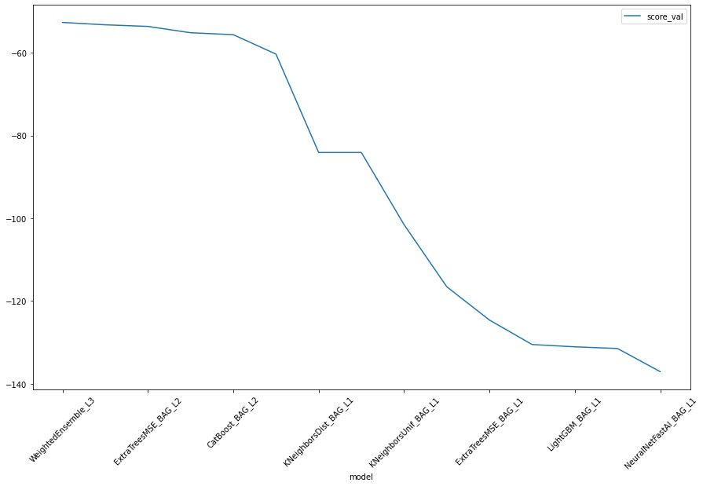
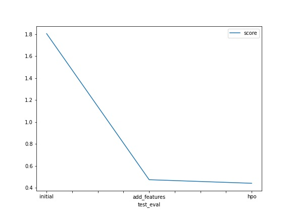

# Report: Predict Bike Sharing Demand with AutoGluon Solution
#### Muhammed Khaled

## Initial Training
### What did you realize when you tried to submit your predictions? What changes were needed to the output of the predictor to submit your results?
 the data needs to be preprocessed to give the model some complexity by creating some features, first i ensured that there were no negative values and if there was i changed them to zeros using np.where() then i loaded the sample submission and replaced the count columns with the predictions and submitted.

### What was the top ranked model that performed?
 for the inital model a WeightedEnsemble_L3 model top performed with a score -52.808431. overall the hpo tuned model overperformed and the top model in it is XGBoost_BAG_L1/T1 with a score -37.907657 

## Exploratory data analysis and feature creation
### What did the exploratory analysis find and how did you add additional features?
   
        
        - the train dataset had 10886 data points in the training sets no null values,test set has 6493 data points

        - there are 4 categorical features season and weather each feature has 4 different values encoded with integers (1,2,3,4) and holiday and workingday are binary encoded (0 or 1).

        - corr() method revealed that temp and atemp features are the highest correlated features with the target count

        - at first glance feature scalling was tried on temp features but hurt performance so it was ignored

        - datetime feature was used mainly to extract features from it (year,month,day,hour,minute,second) using pd.to_datetime and .dt method to extract the values  

        - using .dt.dayofweek to create new feature from day number to figure out which day of the week (eg:monday) this feature helps

        - created feature PM/AM to figure out time of day based on time but went on to later drop it because performance wasn't improved

        - month feature was dropped also as it didn't help perfomance nor had a good corrlation with target, tried to drop holiday feature as corr() method implied weak correlation but it hurt the score so it was kept

        - datetime column feature was dropped after all previous features were extracted from it and trained performance increased  

### How much better did your model preform after adding additional features and why do you think that is?
 the root mean squared error went down from 1.80574 to 0.47512, adding more features helps the model find the right answer and guide it within the data and increase some level of complexity for example the features extracted from the datetime guided the model which particular days of the week have the most demand (saturday and fridays in the data)

## Hyper parameter tuning
### How much better did your model preform after trying different hyper parameters?
 the root mean squared error went down from 1.80574 to 0.47512 after adding some features then to 0.44263 after tuning models hyperparameters.

### If you were given more time with this dataset, where do you think you would spend more time?
 trying to engineer more features and if we have more data we can get a much much better model

### Create a table with the models you ran, the hyperparameters modified, and the kaggle score.
|    | model        | hpo1                                                                                                        | hpo2                                                   | hpo3                                                  |   score |
|---:|:-------------|:------------------------------------------------------------------------------------------------------------|:-------------------------------------------------------|:------------------------------------------------------|--------:|
|  0 | initial      | defaults                                                                                                    | defaults                                               | defaults                                              | 1.80574 |
|  1 | add_features | defaults                                                                                                    | defaults                                               | defaults                                              | 0.47512 |
|  2 | hpo          | NN: num_epochs : 10, learning_rate: 1e-4 to 1e-2, activation: relu ,softrelu ,tanh, dropout_prob : 0.0, 0.5 | GMB: num_boost_round:100, num_leaves:spaceint 26 to 66 | XGB: n_estimators:10000, num_leaves:spaceint 26 to 66 | 0.44263 |

### Create a line plot showing the top model score for the three (or more) training runs during the project.

### Create a line plot showing the top kaggle score for the three (or more) prediction submissions during the project.

## Summary
 downloaded the data using kaggle api and loaded the data into pandas dataframe:
        - using eda i figured out which is the categorical features and the numerical features 
        - the cat features were already encoded 
        - the datetime feature was used to extract features that helped detecting which days have more demand
        - modeling with and fine tuning the model with different hyperparameters increased performance
